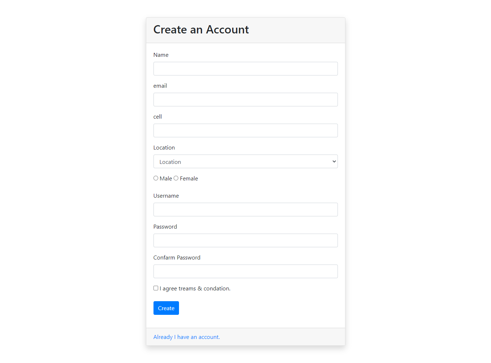
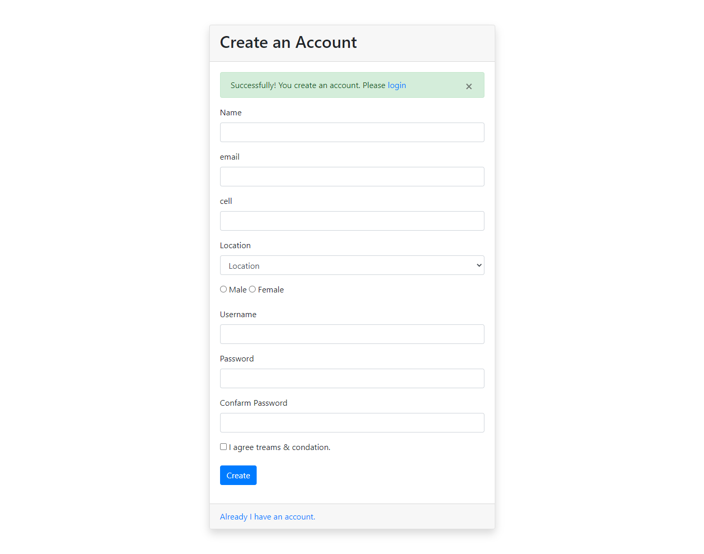

# Haaaaa.... I'm done.

 This Markdown cheat sheet provides a quick overview of all the Markdown syntax elements. It can’t cover every edge case, so if you need more information about any of these elements, refer to the reference guides for.

 This Markdown cheat sheet provides a quick overview of all the Markdown syntax elements. It can’t cover every edge case, so if you need more information about any of these elements, refer to the reference guides for.

 This Markdown cheat sheet provides a quick overview of all the Markdown syntax elements. It can’t cover every edge case, so if you need more information about any of these elements, refer to the reference guides for.

 > Made By Mi Pallab

 [My FB profile](https://www.facebook.com/majadul.islam.3532/)

- Sign Up Page

- When Sign Up Compleate

 **Thank You** :heart: :heart: :heart: